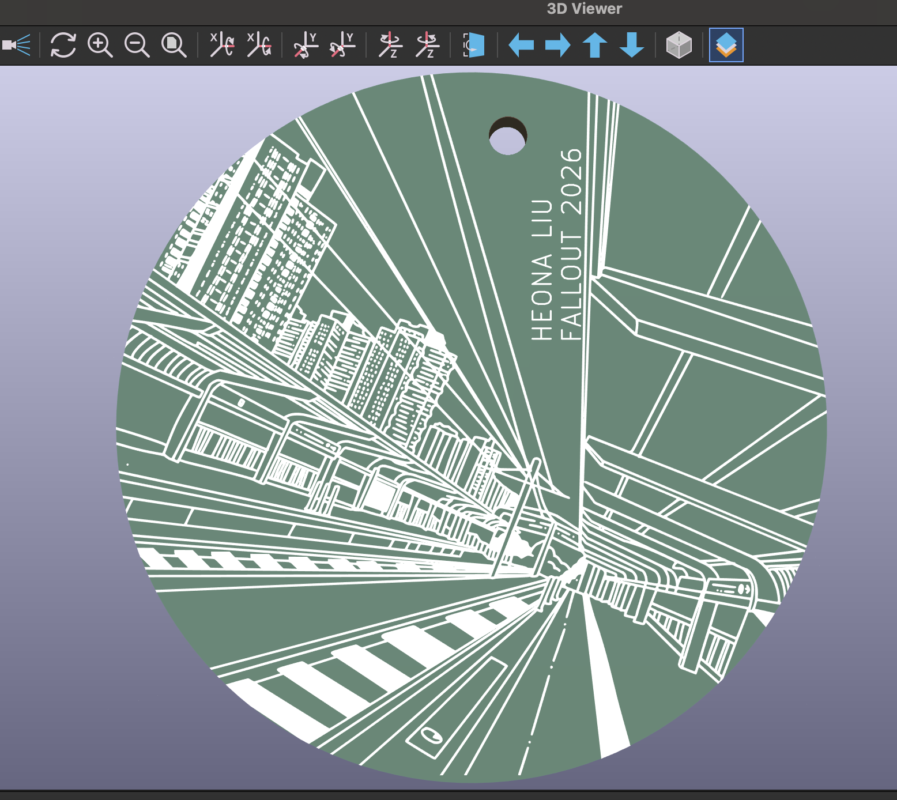
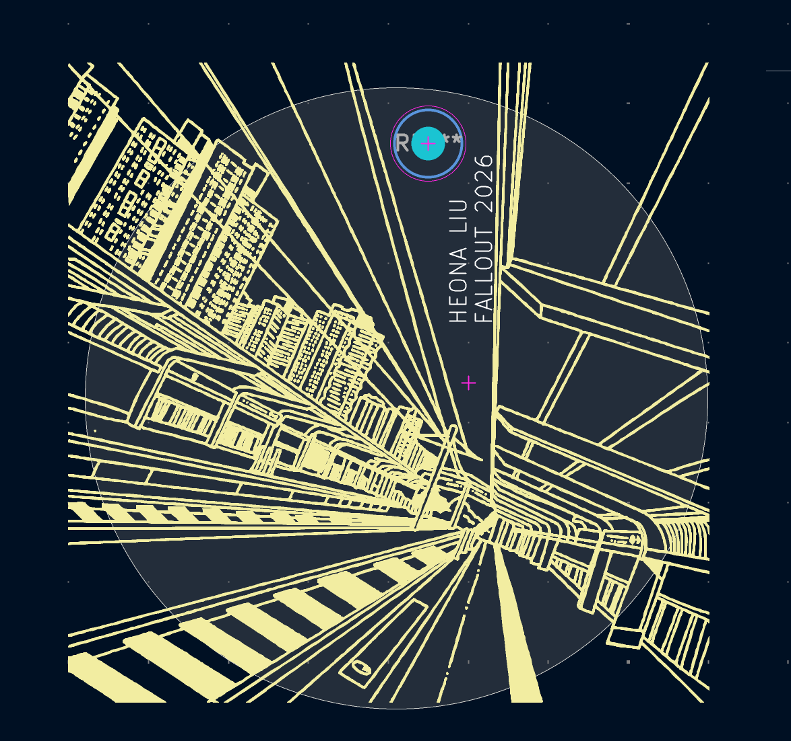

# Custom PCB!

- mainly focused on creating a cool silkscreen.. I didn't have much time and slow wifi to add electrical components.

- This was created with a top layer of silkscreen, mounting hole, and layer.

- no schematic was used and no electronic parts were utilized so there isn't a BOM

- Made by heona for Hack Club Fallout 2026